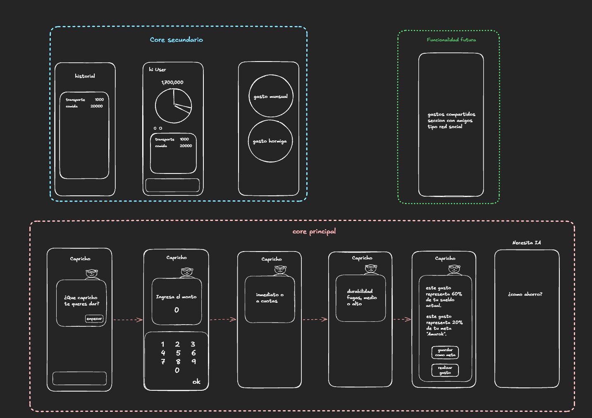
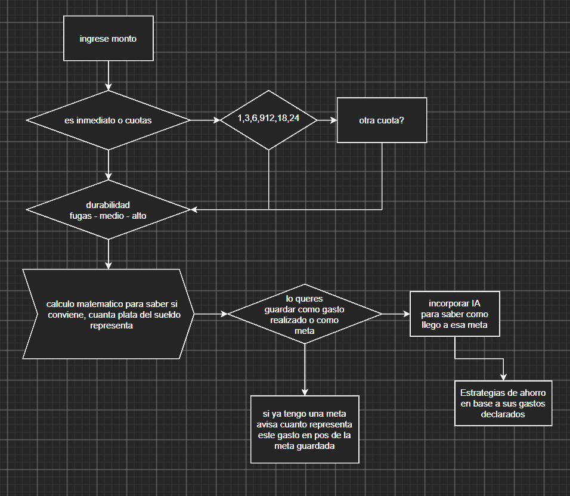
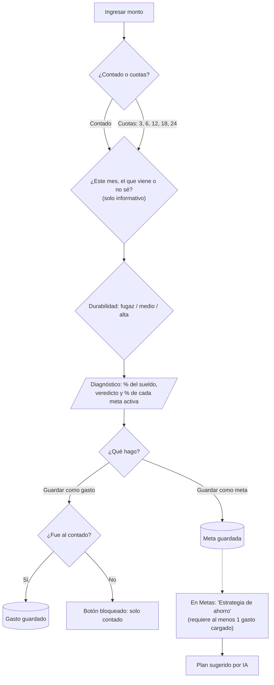
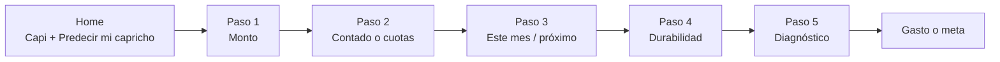
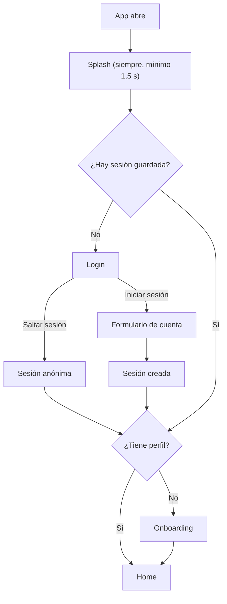
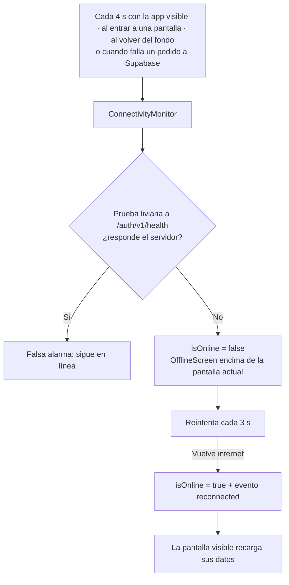
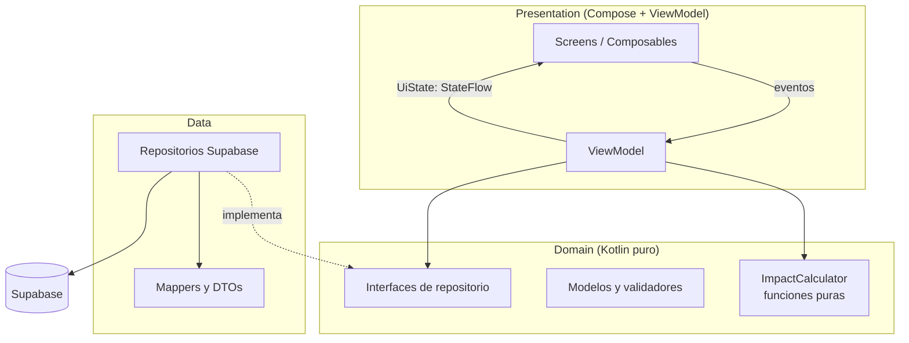
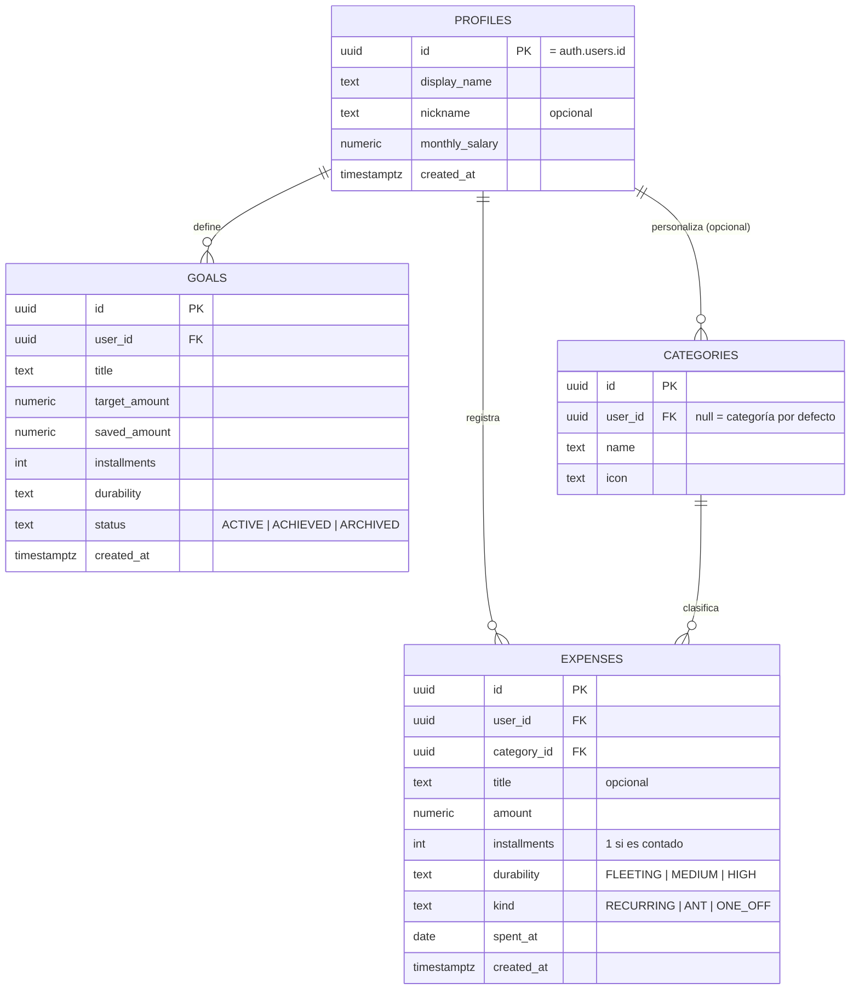

# 🐻 Capricho

> **Date el gusto, pero sabiendo lo que te cuesta.**
> App de finanzas personales hecha con Kotlin Multiplatform que te ayuda a decidir si un gasto te conviene *antes* de hacerlo, sin culpa y sin planillas. Con la cara de un bicho virtual de los 90.

Proyecto desarrollado para el **Challenge Técnico - Software Engineer Mobile (AranguriApps)**.


---

## 📑 Índice

1. [De qué trata el proyecto](#-de-qué-trata-el-proyecto)
2. [Estado de la entrega (leer primero)](#-estado-de-la-entrega-leer-primero)
3. [Visión y cómo evolucionó](#-visión-y-cómo-evolucionó)
4. [Del boceto al producto final](#-del-boceto-al-producto-final)
5. [Identidad visual: un Tamagotchi de los 90](#-identidad-visual-un-tamagotchi-de-los-90)
6. [Historia de usuario](#-historia-de-usuario)
7. [Funcionalidades](#-funcionalidades)
8. [Flujo principal y lógica de cálculo](#-flujo-principal-y-lógica-de-cálculo)
9. [Sesión, login y limitaciones conocidas](#-sesión-login-y-limitaciones-conocidas)
10. [Especificaciones técnicas](#-especificaciones-técnicas)
11. [Arquitectura y por qué la elegí](#-arquitectura-y-por-qué-la-elegí)
12. [Modelo de datos (Supabase)](#-modelo-de-datos-supabase)
13. [Uso de IA en el desarrollo](#-uso-de-ia-en-el-desarrollo)
14. [Cómo compilar y correr el proyecto](#-cómo-compilar-y-correr-el-proyecto)
15. [Testing y CI](#-testing-y-ci)
16. [Roadmap: qué se hizo y qué no](#-roadmap-qué-se-hizo-y-qué-no)
17. [Deuda técnica y a definir](#-deuda-técnica-y-a-definir)
18. [Funcionalidades futuras](#-funcionalidades-futuras)
19. [Decisiones y trade-offs](#-decisiones-y-trade-offs)

---

## 🎯 De qué trata el proyecto

**Capricho** es una app móvil (Android + iOS) para personas **sin conocimientos de finanzas** que quieren cuidar su bolsillo sin sentirse juzgadas.

La idea central es simple: en vez de registrar un gasto *después* de hacerlo, la app te pregunta **"¿qué capricho te querés dar?"** y, en pocos toques, te muestra **cuánto representa ese gasto de tu sueldo** y **cuánto te aleja de tus metas**. Con esa información, el usuario decide si lo **guarda como gasto** o lo **guarda como meta**. Desde una meta puede pedirle a una IA una **estrategia de ahorro** basada en sus propios gastos.

La app tiene dos núcleos que van de la mano:

| Núcleo | Qué resuelve | Estado |
|---|---|---|
| **Core principal** | Flujo guiado "Capricho": monto → cuotas → cuándo impacta → durabilidad → diagnóstico → gasto o meta | ✅ Funciona de punta a punta |
| **Core secundario** | Gastos (historial + gráfico por categoría), metas y perfil | 🟡 Parcial: ver [Estado de la entrega](#-estado-de-la-entrega-leer-primero) |

---

## 🧭 Estado de la entrega (leer primero)

Este README empezó como el plan del proyecto y se fue actualizando a medida que se construía. En la versión final **no todo lo planeado llegó a hacerse**. Esta sección resume la situación sin maquillaje; el detalle está más abajo.

### ✅ Funciona
- Splash, sesión persistente y navegación guiada por el estado de sesión.
- Alta de cuenta con **correo y contraseña**, ingreso, y modo **"Saltar sesión"** (sesión anónima de Supabase).
- Onboarding (nombre, apodo opcional, sueldo mensual), guardado en Supabase y editable desde el perfil.
- Flujo "Predecir mi capricho" completo, con diagnóstico de impacto sobre el sueldo y sobre cada meta activa.
- Guardar el capricho como **gasto** (solo si es al contado) o como **meta**.
- **Gastos:** alta, edición y baja; resumen contra el sueldo, barra de presupuesto y gráfico de torta por categoría en el detalle.
- **Metas:** alta, edición, baja, "anotar ahorro" y sección de metas cumplidas.
- **Estrategia de ahorro con IA** (vía Edge Function de Supabase) a partir de una meta.
- **Pantalla de sin conexión** con detección proactiva y recuperación automática.
- Tema claro y oscuro con estética de bicho virtual de los 90, mascota pixel art con 11 estados de ánimo.
- Suite de tests de dominio, ViewModels y utilidades (149 tests en 25 archivos).

### 🟡 Hecho a medias
- **Filtro de período (Día / Mes / Año):** los botones están en la pantalla de Gastos pero **todavía no filtran** ni la lista ni el gráfico. Además, el boceto pedía semanal y quedó "Día".
- **Categorías:** se elige una al guardar un gasto y alimentan el gráfico, pero no hay pantalla para administrarlas ni un gráfico por período.
- **Paso "¿Afecta este mes o el que viene?":** se pregunta y se guarda en el estado, pero **no entra en ningún cálculo** (ver [deuda técnica](#-deuda-técnica-y-a-definir)).
- **Semáforo por durabilidad:** existe `DurabilityPolicy` con sus tests, pero el diagnóstico real usa reglas propias dentro del ViewModel. Hoy conviven dos criterios.

### ❌ No se hizo
- **Login con Google.** Estaba planeado como método principal; no hay código al respecto en la versión final. Se reemplazó por correo y contraseña.
- **Gasto hormiga vs. gasto mensual** (los dos círculos del boceto). El modelo de datos tiene el campo `kind` (`RECURRING` / `ANT` / `ONE_OFF`), pero la interfaz no lo expone: todo gasto se guarda como `ONE_OFF`.
- **Fallback local de la estrategia de IA.** Si la IA falla, la app muestra un error con opción de reintentar; no hay consejos genéricos de respaldo.
- **"Otra cantidad de cuotas".** Las opciones son 1, 3, 6, 12, 18 y 24 (se descartó el 9 y no hay campo libre).
- **Atraso en meses de una meta** (`delayInMonths`): la función existe y está testeada, pero no se muestra en ninguna pantalla.
- **Cuotas guardadas como gasto.** Por decisión de diseño, solo el contado se guarda como gasto; las cuotas solo pueden terminar como meta.
- **Funcionalidades futuras** (gastos compartidos, modo offline real, etc.): quedan como ideas.
- **Verificación en iOS.** Se desarrolló y probó en Android; no hubo acceso a macOS.


---

## 🌱 Visión y cómo evolucionó

**Visión original (se mantiene):** cuidar el bolsillo del usuario y ayudarlo a **proyectar sus gastos de forma eficiente, cómoda y agradable**, sin generarle culpa.

Principios de producto:

- **Cero culpa.** Tono amigable, una mascota simpática, lenguaje cercano. La app informa, no reta.
- **Cero conocimiento financiero previo.** Nada de tasas, TNA ni jerga. Débito/crédito se vuelve indistinto: lo único que importa es *contado o en cuotas*.
- **Mínima fricción.** El usuario casi no escribe: ingresa el monto con un teclado numérico y el resto se resuelve tocando **pills**.
- **Información antes que registro.** La app es útil en el momento de decidir, no solo para llevar la contabilidad.
- **Salud financiera progresiva.** Del "¿me conviene?" a "¿cómo llego antes a mi meta?".

**Cómo cambió la visión durante el desarrollo:**

1. **De "app de finanzas" a "compañero".** El plan arrancó pensando en un dashboard con un gráfico como pantalla central y una mascota de apoyo. Terminó al revés: la pantalla de inicio es la mascota (un bicho virtual) y el dashboard pasó a ser una pestaña más.
2. **La mascota pasó de decoración a interfaz.** Capi reacciona al toque, habla con efecto de máquina de escribir, "duerme" cuando se apaga la pantalla, "busca señal" cuando no hay internet y cambia de ánimo según el veredicto del capricho.
3. **Del "registrar" al "predecir".** Se confirmó la idea de que la app sirva *antes* del gasto. El historial quedó como soporte (hace falta tener gastos cargados para que la IA pueda armar una estrategia), no como protagonista.
4. **La IA dejó de ser un paso del flujo.** En el diagrama inicial la estrategia de ahorro venía justo después de guardar la meta. En la versión final se pide **desde la pantalla de Metas** y exige tener al menos un gasto cargado. Es un cambio de producto, no solo de interfaz: el flujo del capricho quedó corto y rápido, y la estrategia es una acción aparte.
5. **Las metas crecieron.** En el boceto una meta era solo un número contra el cual comparar. Terminaron siendo una sección propia: se pueden editar, se les va sumando ahorro, y las cumplidas se separan.
6. **Se agregó robustez que no estaba en el plan:** pantalla de sin conexión, validaciones de sueldo sospechosamente bajo, avisos al editar una meta ya ahorrada, deduplicación de navegación.

---

## ✏️ Del boceto al producto final

El diseño empezó en papel digital. Los bocetos originales viven en [`docs/`](docs/):

| Archivo | Qué es |
|---|---|
| [`docs/boceto-excalidraw.png`](docs/boceto-excalidraw.png) | Boceto de pantallas hecho en Excalidraw: core principal, core secundario y funcionalidad futura |
| [`docs/flujo-drawio.png`](docs/flujo-drawio.png) | Diagrama de flujo hecho en draw.io con la lógica del cálculo |






**Qué decía el boceto y qué pasó con cada cosa:**

| Idea del boceto | En la versión final |
|---|---|
| Pantalla "Capricho" con la mascota y *"¿Qué capricho te querés dar?"* | ✅ Se mantiene como Home, pero la mascota vive dentro de un bicho virtual con pantalla LCD |
| Ingreso de monto con teclado numérico | ✅ Teclado numérico propio, estilo pixel |
| "Inmediato o cuotas" con pills 1, 3, 6, 9, 12, 18, 24 y "otra cuota" | 🟡 Pills 1 (contado), 3, 6, 12, 18 y 24. Sin 9 y sin "otra" |
| Durabilidad: fugaz / medio / alto | ✅ Se mantiene, con ejemplos para cada opción |
| Pantalla de impacto: "representa 60% de tu sueldo" y "20% de tu meta" | ✅ Impacto sobre el sueldo + por cada meta activa: "hoy te falta X% → con este capricho te faltaría Y%" |
| Botones "guardar como meta" / "realizar gasto" | ✅ Con la regla extra de que el gasto solo se guarda al contado |
| "¿Cómo ahorro?" con IA (marcado como *necesita IA*) | 🟡 Existe, pero se pide desde Metas, no como pantalla final del flujo |
| Home del core secundario: saludo, total, torta y lista de movimientos | 🔀 El saludo está en el Home; torta y lista quedaron en la pestaña **Gastos** |
| Historial de gastos | ✅ Pestaña **Gastos** |
| Pantalla de **gasto mensual** y **gasto hormiga** | ❌ No se hizo |
| Funcionalidad futura: gastos compartidos, sección con amigos tipo red social | 🔮 Fuera de alcance, sin cambios |
| *(no estaba)* paso "¿Este mes o el que viene?" | ➕ Agregado durante el desarrollo; hoy es solo informativo |
| *(no estaba)* pestaña de Metas con ahorro acumulado | ➕ Agregada |
| *(no estaba)* Perfil, onboarding, cuenta con correo, pantalla offline | ➕ Agregados |

---

## 🕹 Identidad visual: un Tamagotchi de los 90

El boceto era deliberadamente neutro: cajas, textos y un personaje. La identidad visual se definió después, ya con el producto andando, y se inspiró en los **bichos virtuales de los 90**: ese objeto de plástico con pantalla LCD que había que cuidar.

La idea conecta con el producto: igual que el Tamagotchi, Capi **depende de cómo lo trates**, y así como se te ocurre "¿qué capricho me doy hoy?", tu bolsillo es lo que hay que cuidar. Todo con humor y sin culpa.

**Decisiones de diseño:**

- **Dos temas con nombre propio.**
  - *Tamagotchi de noche* (oscuro): negro verdoso de fósforo (`#0E1610`), lima brillante (`#C8F560`) y rosa plástico (`#FF9DB5`). Parece un CRT.
  - *Tamagotchi de día* (claro): papel crema-lima (`#F1F5DF`), tinta verde (`#3A7000`) y rosa plástico (`#B3365A`). La profundidad viene de la tinta: bordes y sombras duras marcadas.
- **Tipografía en dos capas.** **Silkscreen** (pixel) para títulos, botones, números grandes y etiquetas cortas; **Nunito** para todo lo que se lee de corrido. El estilo retro vive en los detalles y la lectura sigue siendo cómoda.
- **Componentes pixel propios:** botones, diálogos, campos, pills, teclado numérico y barra inferior con esquinas escalonadas (`PixelCutShape`) y sombras duras, sin sombras suaves.
- **Íconos dibujados en código.** No se usa `material-icons`: los íconos de la barra (Inicio, Gastos, Metas, Perfil) se dibujan con `Canvas`.
- **Mascota "Capi" en pixel art.** Sprites definidos como grillas de texto, dibujados con `Canvas` y animados con `Animatable` / `InfiniteTransition`. Tiene 11 estados: `Idle`, `Talking`, `Thinking`, `Happy`, `Worried`, `Sad`, `Panicked`, `Crazy`, `Celebrating`, `Sleeping` y `Searching`.
- **El Home es el bicho.** Pantalla LCD con indicador de canal (como un televisor chico): se puede cambiar entre los estados de ánimo de Capi, apagar y prender el dispositivo, y Capi habla con efecto de tipeo.
- **El veredicto tiene cara.** El diagnóstico del capricho no es solo un número: Capi lo comunica con su ánimo y un mensaje.
- **Cero assets externos de diseño:** sin GIFs, Lottie ni imágenes. Todo el arte es código, se adapta a ambos temas y se ve igual en Android e iOS.

> Los íconos y sprites tienen tests que verifican que todos los frames tengan las mismas dimensiones.

---

## 👤 Historia de usuario

> **Lucía, 27 años, sueldo de $1.700.000.** No sabe de finanzas, pero siempre llega justa a fin de mes. Quiere comprarse unas zapatillas de $240.000 y, a la vez, está ahorrando para un viaje (meta "Bariloche").

1. Lucía abre la app por primera vez, **crea su cuenta con correo y contraseña** y completa su nombre, un apodo opcional y su sueldo actual. No se lo vuelve a pedir (lo puede editar en su perfil).
2. En el Home, **Capi** le pregunta qué capricho se le antoja. Toca **"Predecir mi capricho"**.
3. Escribe el **monto** con el teclado numérico.
4. Elige si paga **al contado** o **en cuotas** (3, 6, 12, 18 o 24).
5. Indica si el gasto **pega este mes, el mes que viene o todavía no sabe**.
6. Elige la **durabilidad**: *fugaz*, *medio* o *alta*.
7. Capi le muestra el **diagnóstico**: *"Este capricho representa el X% de tu sueldo"* y, para cada meta, *"hoy te falta 77% → con este capricho te faltaría 84%"*.
8. Decide: **Guardar como gasto** (si fue al contado) o **Guardar como meta**.
9. Más tarde, en **Metas**, abre "Bariloche", anota cuánto ahorró y, si ya cargó algún gasto, toca **"Estrategia de ahorro"** para que la IA le proponga un plan basado en sus gastos reales.
10. En **Gastos** ve su historial, cuánto del sueldo lleva gastado y el gráfico por categoría.

---

## ✨ Funcionalidades

### Core principal
- [x] Splash (mínimo 1,5 s) y navegación guiada por el estado de sesión, con **sesión persistente**
- [x] Cuenta con **correo y contraseña** (alta e ingreso) con validaciones
- [x] Botón **"Saltar sesión (temporal)"**: entra con una sesión anónima de Supabase
- [ ] ~~Login con Google~~ → **no implementado** (ver [limitaciones](#-sesión-login-y-limitaciones-conocidas))
- [x] Onboarding (nombre, apodo opcional, sueldo) persistido en Supabase, con confirmación si el sueldo parece demasiado bajo
- [x] Home con bicho virtual: pantalla LCD, mascota animada que habla y reacciona al toque
- [x] Barra de navegación inferior con íconos pixel art: Inicio, Gastos, Metas y Perfil
- [x] **Pantalla de sin conexión** con recuperación automática
- [x] Ingreso de monto con teclado numérico propio (hasta 8 dígitos)
- [x] Contado / cuotas con pills (1, 3, 6, 12, 18, 24)
- [ ] Cantidad de cuotas libre ("otra")
- [x] Selección de cuándo impacta (este mes / el que viene / no sé) — *solo informativo*
- [x] Selección de durabilidad (fugaz / medio / alta)
- [x] Diagnóstico: % del sueldo, veredicto y % de impacto en cada meta activa
- [x] Guardar como **gasto** (solo contado) o como **meta**
- [x] **Estrategia de ahorro con IA** desde una meta (requiere al menos un gasto cargado)
- [ ] Fallback local cuando la IA no responde

### Core secundario
- [x] **Gastos:** alta, edición, baja, resumen contra el sueldo y barra de presupuesto
- [x] Gráfico de torta por categoría (en el detalle del resumen)
- [x] Elegir categoría al guardar un gasto
- [ ] Filtro de período funcional (los botones Día / Mes / Año existen pero **no filtran**)
- [ ] Marca de **gasto hormiga** vs. **gasto mensual**
- [ ] Administrar categorías propias
- [x] **Metas:** alta, edición, baja, "anotar ahorro", sección de cumplidas
- [x] **Perfil:** edición de nombre, apodo y sueldo; cerrar sesión

---

## 🔁 Flujo principal y lógica de cálculo

### Diagrama de flujo (versión implementada)



El diagrama original (draw.io) está en [`docs/flujo-drawio.png`](docs/flujo-drawio.png). Las diferencias: se agregó el paso de "cuándo impacta", se restringió el guardado como gasto al contado y la IA pasó a ser una acción desde Metas.

### Pantallas del flujo



### Reglas de cálculo

Los cálculos de impacto son **funciones puras en `commonMain`** (`ImpactCalculator`), sin dependencias de UI ni red, y están testeados. El **veredicto** vive hoy dentro de `PredictCaprichoViewModel` (ver [deuda técnica](#-deuda-técnica-y-a-definir)).

**1. Impacto sobre el sueldo**

```
pago mensual     = monto / cuotas          (contado = 1 cuota)
impacto sueldo   = pago mensual / sueldo
```

> Se asumen **cuotas sin interés** (es lo más común en el público objetivo y evita pedir datos financieros). Queda como mejora un campo de interés.

**2. Impacto sobre cada meta activa**

```
te falta hoy      = (meta - ahorrado) / meta
te faltaría       = (meta - ahorrado + monto) / meta     (puede superar 100%)
```

La app muestra ambos valores. Si la meta ya está cumplida, no entra en el diagnóstico. Las metas se ordenan de la que más te aleja a la que menos.

**3. Veredicto del diagnóstico (reglas reales, en orden de evaluación)**

El porcentaje evaluado es el del **pago mensual sobre el sueldo**.

| # | Condición | Veredicto |
|---|---|---|
| 1 | Impacto > 150 % | 🔴 Pesado |
| 2 | Impacto > 100 % | 🔴 Pesado |
| 3 | Durabilidad **alta** e impacto ≤ 15 % | 🟢 Gran capricho |
| 4 | Durabilidad **fugaz** e (impacto > 10 % **o** en cuotas) | 🔴 Pesado |
| 5 | Durabilidad **media** e impacto ≤ 20 % | 🟢 Gran capricho |
| 6 | Impacto > 25 % | 🔴 Pesado |
| 7 | Cualquier otro caso | 🟡 Riesgo moderado |

El mensaje de Capi acompaña al veredicto. En lo posible es informativo y amable, nunca prohibitivo; los casos extremos (más del 100 % del sueldo) usan un tono más dramático a propósito, dentro del humor del bicho virtual.

> ⚠️ **Sobre el semáforo del README original:** la tabla de umbrales por durabilidad (fugaz 5/10 %, medio 10/25 %, alto 20/40 %) está implementada en `DurabilityPolicy` y testeada, **pero el diagnóstico no la usa**. Las reglas de arriba son las que ve el usuario. Unificar ambos criterios quedó pendiente.

### Estrategia de ahorro con IA

- La app **no manda texto libre del usuario**: arma un pedido estructurado con datos propios (sueldo, meta con lo ahorrado, gastos con su categoría y tipo) y lo envía a una **Edge Function de Supabase**, autenticada con el JWT del usuario.
- La función es la que habla con el modelo de IA, así **la clave nunca vive en el cliente**.
- La respuesta tiene un esquema fijo (`summary`, `tips`, `estimatedSavings`) para renderizarse en UI nativa.
- Si el usuario no tiene gastos cargados, no se hace el pedido y se le explica por qué.
- Si el pedido falla (función caída, cuota agotada, respuesta inválida), se muestra un mensaje amable con opción de reintentar. El detalle técnico va solo al log.
- ⚠️ **No hay respuesta de respaldo local.** Si la IA no responde, el usuario no recibe consejos.


---

## 🔐 Sesión, login y limitaciones conocidas

### Flujo de arranque



- La **Splash se muestra siempre** y espera a que Supabase termine de cargar la sesión guardada.
- **Única fuente de verdad:** el estado de sesión. `SessionViewModel` lo combina con la existencia del perfil en `SessionState` (`Loading`, `SignedOut`, `NeedsOnboarding`, `Ready`, `ProfileError`) y `AppNavHost` navega en función de eso, también si la sesión se cierra o vence.
- **Persistencia:** `supabase-kt` guarda y restaura la sesión entre ejecuciones.
- **Onboarding (solo la primera vez):** **sin fila en `profiles` → Onboarding; con fila → Home.** Si no se puede consultar el perfil (por ejemplo sin internet) la app **no** manda al usuario al onboarding, para no pisar sus datos: muestra un error con *Reintentar*.
- **Crear cuenta:** el formulario pide nombre, apodo, sueldo, correo y contraseña en una sola pantalla. Si en Supabase está activada la confirmación de correo, la app lo informa.

### Pérdida de conexión con sesión iniciada



- **Proactiva:** no espera a que falle una llamada.
- **Sin APIs de cada plataforma:** el monitor *verifica* con un pedido liviano (cualquier respuesta HTTP cuenta como "hay internet") en lugar de adivinar por el tipo de excepción.
- **La pantalla se superpone, no navega:** así el back stack, lo que escribió el usuario y la pestaña actual quedan intactos. En la pantalla, Capi "busca señal".
- **Recuperación automática:** al volver internet se recargan Metas, Gastos y Estrategia (si estaba en error).

### Limitaciones conocidas

| Limitación | Detalle | Mitigación / futuro |
|---|---|---|
| **No hay login con Google** | Estaba planeado como método principal (Credential Manager en Android), pero **no se implementó**. Se optó por correo y contraseña, que no requiere configurar credenciales de Google Cloud. | Futuro: Google en Android y Apple/Google en iOS. |
| **Usuario anónimo pierde sus datos** | Quien entra con **"Saltar sesión"** tiene una sesión sin credenciales: si **desinstala la app o cierra sesión**, no puede recuperar su cuenta y **pierde sus datos**. | Crear una cuenta con correo evita el problema. Futuro: **vincular la cuenta anónima a un correo** sin perder datos. |
| **"Saltar sesión" es un atajo de evaluación** | En pantalla figura como *temporal*. Está para que quien evalúe la app pueda probarla sin registrarse. | Quitarlo o esconderlo en una versión publicada. |
| **Sin modo offline** | Sin internet, una pantalla propia tapa la app hasta que vuelve la conexión. No se muestran datos viejos ni se guardan cambios sin red. | Futuro: cache local + cola de escritura. |
| **iOS sin verificar** | El código es compartido y tiene entrada para iOS, pero **no se compiló ni probó en iOS** (no hubo macOS). | Probar en un Mac antes de publicar. |
| **Login anónimo habilitado** | Es necesario para "Saltar sesión" y permite crear usuarios sin registro. | RLS garantiza que cada usuario accede solo a sus filas. Futuro: límites de tasa o CAPTCHA si se publicara. |

---

## 🛠 Especificaciones técnicas

### Stack

| Capa | Tecnología |
|---|---|
| Lenguaje | Kotlin (Multiplatform) |
| UI | Compose Multiplatform (Material 3 con componentes propios pixel) |
| Plataformas | Android (verificado) e iOS (sin verificar) |
| Navegación | Navigation Compose multiplataforma, rutas tipadas con `kotlinx.serialization` |
| Estado | `ViewModel` multiplataforma + `StateFlow` (flujo unidireccional) |
| DI | Koin |
| Backend / BaaS | Supabase (Auth + Postgres + RLS + Edge Functions) con `supabase-kt` |
| Auth | Correo y contraseña + sesión anónima, vía Supabase Auth |
| Red | Ktor Client |
| Serialización | `kotlinx.serialization` |
| Fechas | `kotlinx-datetime` |
| Configuración de claves | BuildKonfig |
| IA | Edge Function de Supabase que consulta al modelo (Gemini) |
| Gráficos | Torta y barra propias con `Canvas` de Compose |
| Mascota / animación | Sprites pixel art en grillas de texto con `Canvas`, `Animatable` e `InfiniteTransition` |
| Estética | Fuentes **Silkscreen** y **Nunito**, esquinas escalonadas, sombras duras, íconos dibujados a mano |
| Tests | `kotlin.test`, `kotlinx-coroutines-test`, fakes manuales |
| CI | GitHub Actions |

> Todas las librerías elegidas son compatibles con KMP/CMP. Se evitan dependencias exclusivas de Android (Hilt, Retrofit, Room, etc.).

### Seguridad de las claves
- La **URL** y la **publishable key** de Supabase se leen desde `local.properties` / variables de entorno (no se commitean). La publishable key está pensada para vivir en el cliente.
- La **clave del modelo de IA no está en el cliente**: la guarda la Edge Function como secret de Supabase.
- Todas las tablas usan **Row Level Security**: cada usuario solo ve sus datos.

### Requisitos no funcionales
- Sin crashes: todo acceso a red se envuelve en `Result` (`runCatchingCancellable`, que no traga las cancelaciones de corrutinas).
- Estados de UI explícitos: carga, contenido, error y vacío.
- Mensajes de error amables: los detalles técnicos van al log y no a la pantalla.
- Validaciones de dominio puras y testeadas (perfil y cuenta).

---

## 🏛 Arquitectura y por qué la elegí

**MVVM + Unidirectional Data Flow (UDF), con capas inspiradas en Clean Architecture**, todo en código compartido (`commonMain`).



**Por qué esta arquitectura:**

- **Separación lógica / vista** (criterio explícito del challenge): los composables renderizan un estado y emiten eventos; la lógica está en los ViewModels y en el dominio.
- **Dominio testeable:** el corazón de la app es matemático (porcentajes, cuotas, metas). Al ser Kotlin puro en `commonMain`, se testea en milisegundos y corre igual en Android e iOS.
- **Repositorios como interfaces:** los tests reemplazan Supabase por fakes en memoria, y facilita sumar funcionalidades futuras.
- **Pragmatismo:** un solo módulo, estructura **feature-first** por paquetes. **No se implementó una capa de casos de uso**: los ViewModels hablan directo con los repositorios y el calculador. Para el alcance del challenge se priorizó avanzar rápido; es un candidato a refactor.

### Estructura del proyecto (real)


```
shared/src/
├── commonMain/
│   ├── composeResources/font/          # Nunito y Silkscreen
│   └── kotlin/com/example/caprichoapp/
│       ├── App.kt                      # Raíz de Compose + Koin
│       ├── core/
│       │   ├── designsystem/           # Tema claro/oscuro, colores, tipografías
│       │   │   ├── mascot/             # Capi: sprites, estados de ánimo
│       │   │   ├── pixel/              # Botón, diálogo, campos, pills, teclado, barra inferior, íconos
│       │   │   └── components/         # Diálogo de sueldo bajo (y otros)
│       │   ├── di/                     # Módulo Koin
│       │   ├── navigation/             # Rutas tipadas, NavHost, pestañas
│       │   ├── network/                # ConnectivityMonitor, ReconnectEffect
│       │   └── util/                   # Formato de montos, teclado numérico, fecha
│       ├── domain/
│       │   ├── model/                  # Profile, Expense, Goal, Category, Durability, ...
│       │   ├── calculator/             # ImpactCalculator, DurabilityPolicy
│       │   ├── repository/             # Interfaces
│       │   └── validation/             # ProfileValidator, AccountValidator
│       ├── data/
│       │   ├── remote/dto/             # DTOs @Serializable
│       │   ├── mapper/                 # DTO ↔ dominio
│       │   └── repository/             # Implementaciones Supabase (+ InMemoryGoalRepository)
│       └── feature/
│           ├── splash/   auth/   onboarding/
│           ├── home/     predict/        # predict = flujo "Capricho" (core principal)
│           ├── history/                  # pestaña "Gastos"
│           ├── goals/    strategy/
│           ├── profile/  offline/
├── commonTest/                         # 149 tests (dominio, ViewModels, red, utilidades, design system)
├── androidMain/                        # PlatformBackHandler (Android)
├── iosMain/                            # MainViewController + PlatformBackHandler (iOS)
└── androidHostTest/ · iosTest/         # Vacías
```

> El paquete base es `com.example.caprichoapp` (valor del template). Quedó sin renombrar.

---

## 🗄 Modelo de datos (Supabase)



**Ejemplo de política RLS:**

```sql
alter table expenses enable row level security;

create policy "Usuarios ven y editan solo sus gastos"
on expenses for all
using (auth.uid() = user_id)
with check (auth.uid() = user_id);
```

> **Notas de estado:**
> - `kind` existe en el modelo pero la app siempre guarda `ONE_OFF`: es la base para el gasto hormiga y el mensual, que **no se implementó**.
> - `status = ARCHIVED` está modelado, pero la interfaz hoy no permite archivar metas.
> - 🔮 `user_id` está presente en todas las tablas y el esquema permite sumar luego `shared_groups` + `group_members` sin migraciones destructivas.


---

## 🤖 Uso de IA en el desarrollo

El challenge pide orquestar IA, no copiar y pegar. Mi flujo de trabajo:

| Herramienta                                          | Para qué la usé | Cómo auditaba su salida |
|------------------------------------------------------|---|---|
| **Claude**                                           | Definir el alcance, estructurar la idea, diseñar el flujo, el modelo de datos y las reglas de cálculo; generar boilerplate de KMP/Compose | Revisión manual de cada decisión; contraste con documentación oficial de KMP y supabase-kt |
| **Asistente de código en el IDE** Gemini y Copilot   | Generar composables, ViewModels, repositorios y tests por tarea | Compilar en Android, correr tests, revisar diffs antes de cada commit |
| **Modelo de IA dentro de la app** (vía Edge Function) | Funcionalidad *dentro* de la app: estrategias de ahorro | Esquema de respuesta fijo, validación de que haya resumen, manejo de errores |

**Cómo guié a la IA:**
- Trabajé **tarea por tarea**, con el contexto de arquitectura y convenciones del proyecto.
- Primero la **lógica de dominio con tests**, después la UI. Los tests sirvieron como contrato para detectar errores de la IA.
- Corregí problemas que la IA resuelve mal en KMP: dependencias solo-Android, diferencias de comportamiento en iOS, recomposiciones innecesarias, manejo de errores de red y serialización (por ejemplo, un campo con valor por defecto que `kotlinx.serialization` no enviaba y rompía el insert).

---

## 🚀 Cómo compilar y correr el proyecto

### Requisitos
- **JDK 17+**
- **Android Studio** (última versión estable) con el plugin *Kotlin Multiplatform*
- **Xcode 15+** y macOS (solo para iOS, **sin verificar**)
- Cuenta gratuita de **Supabase** y la Edge Function de estrategia desplegada

> ℹ️ **Sobre iOS:** el proyecto se desarrolló y verificó en Android. En Windows/Linux, Gradle muestra el aviso *"iosSimulatorArm64Test is disabled"*; es esperable y se silencia con `kotlin.native.ignoreDisabledTargets=true` en `gradle.properties`.

### 1. Clonar
```bash
git clone https://github.com/Gaburiiru/capricho.git
cd capricho
```

### 2. Configurar Supabase
1. Crear un proyecto en [supabase.com](https://supabase.com).
2. Ejecutar las migraciones de `supabase/migrations/` en el SQL Editor.
3. En *Authentication → Sign In / Providers*:
   - Habilitar **Email**. Para probar rápido conviene **desactivar "Confirm email"**; si queda activado, la app avisa que hay que confirmar el correo.
   - Habilitar **Allow anonymous sign-ins** (necesario para "Saltar sesión").
   - Apretar **Save changes** en cada cambio.
4. Desplegar la **Edge Function** de estrategia de ahorro y cargar la clave del modelo de IA como *secret*.
5. Copiar la **Project URL** y la **publishable key** (Project Settings → API Keys).

### 3. Variables de entorno
Crear `local.properties` en la raíz (está en `.gitignore`):

```properties
SUPABASE_URL=https://xxxx.supabase.co
SUPABASE_PUBLISHABLE_KEY=sb_publishable_...
```


### 4. Correr en Android
Abrir el proyecto en Android Studio, elegir la configuración `androidApp` y ejecutar en un emulador o dispositivo. O por terminal:

```bash
./gradlew :androidApp:installDebug
```

### 5. Generar el APK
```bash
# Debug (instalable directo)
./gradlew :androidApp:assembleDebug
# APK en androidApp/build/outputs/apk/debug/
```

### 6. Correr en iOS (macOS, sin verificar)
1. Abrir `iosApp/iosApp.xcodeproj` en Xcode.
2. Elegir un simulador y presionar **Run**.

### 7. Tests
```bash
./gradlew :shared:testAndroidHostTest
```

---

## ✅ Testing y CI

- **149 tests en 25 archivos** (`commonTest`), todos en Kotlin común y ejecutables en JVM, sin emulador.
- **Qué cubren:**
  - **Dominio:** `ImpactCalculator`, `DurabilityPolicy`, modelos (`Goal`, `Profile`) y validadores (`ProfileValidator`, `AccountValidator`).
  - **ViewModels** con repositorios *fake*: sesión, cuenta, onboarding, flujo del capricho, metas, gastos (historial) y estrategia.
  - **Infraestructura:** `ConnectivityMonitor`, formato de montos, entrada del teclado numérico, tamaño de fuente del monto, mappers y codificación de DTOs.
  - **Design system:** íconos y sprites (dimensiones consistentes), estilos de texto, pantalla offline.
- **Casos de borde:** sueldo inválido, monto cero, cuotas = 1, meta sin ahorro, meta ya cumplida, fallo de red, edición de meta con ahorro mayor al nuevo objetivo.
- **Sin cobertura:** no hay tests de UI instrumentados, ni tests de la integración real con Supabase.

```bash
./gradlew :shared:testAndroidHostTest
```

## ci.yml
```
name: CI

on:
  push:
  pull_request:

jobs:
  build-and-test:
    runs-on: ubuntu-latest
    steps:
      - uses: actions/checkout@v4

      - uses: actions/setup-java@v4
        with:
          distribution: temurin
          java-version: 17

      - uses: gradle/actions/setup-gradle@v4

      - name: Tests y build
        run: ./gradlew :shared:testAndroidHostTest :androidApp:assembleDebug
```

> El CI no compila iOS: requiere un runner macOS, más lento y costoso.

---

## 🗓 Roadmap: qué se hizo y qué no

Fecha límite de entrega: **8 de octubre de 2026, 23:59**. El plan original iba **de menor a mayor** y priorizaba el core principal. Este es el estado final contra ese plan:

### Fase 0 · Base
- [x] README inicial con visión, flujo y arquitectura
- [x] Proyecto KMP base, Koin y Ktor
- [x] Eliminar código de ejemplo del template
- [x] Tema, paleta y tipografías
- [x] Mascota pixel art con estados
- [x] Pills y teclado numérico
- [x] CI de GitHub Actions

### Fase 1 · Dominio (con tests)
- [x] Modelos `Expense`, `Goal`, `Profile`
- [x] `ImpactCalculator`: impacto sobre sueldo y cuotas
- [x] `DurabilityPolicy` y semáforo *(implementado y testeado, **pero sin conectar** al diagnóstico)*
- [x] Casos de borde del cálculo
- [x] Impacto sobre metas
- [ ] Atraso en meses de una meta *(función lista, **sin mostrar en la UI**)*

### Fase 2 · Backend y sesión
- [x] Esquema SQL + RLS
- [x] Cliente de Supabase y claves desde `local.properties`
- [x] `AuthRepository` y estado de sesión
- [x] NavHost con Splash, Login y Home
- [x] Splash con mascota
- [x] Login con opción de saltar
- [ ] ~~Login con Google nativo (Android)~~ → **no se hizo**
- [x] ➕ Cuenta con correo y contraseña *(reemplazo no planeado)*
- [x] Onboarding: nombre, apodo y sueldo

### Fase 3 · Core principal
- [x] Home con mascota animada
- [x] Barra inferior con Gastos, Metas, Inicio y Perfil
- [x] Ingreso de monto con teclado numérico
- [x] Contado / cuotas con pills *(sin "otra")*
- [x] Durabilidad
- [x] Pantalla de diagnóstico (% sueldo / % meta)
- [x] Guardar como gasto *(solo contado)*
- [x] Guardar como meta
- [x] Estrategia de ahorro con IA *(sin fallback local)*

### Fase 4 · Core secundario
- [x] Gráfico de torta por categoría
- [ ] Filtros por período *(UI presente, **sin efecto**)*
- [x] Historial de gastos (alta, edición y baja)
- [ ] Gasto hormiga vs. mensual
- [x] Categorías al guardar un gasto
- [x] Edición de perfil
- [x] ➕ Metas con ahorro acumulado, edición y cumplidas

### Fase 5 · Pulido y entrega
- [x] Auditoría de crashes, estados vacíos y errores de red
- [x] Pantalla de sin conexión con recuperación automática
- [x] Transiciones y animaciones de la mascota
- [x] Capturas, diagramas

> **Regla de oro del tiempo:** si algo del core secundario no llega, se recorta *funcionalidad*, nunca *estabilidad*. Eso fue lo que pasó: el filtro de período y el gasto hormiga se quedaron afuera para llegar con una app que no crashea.

---

## 🧱 Deuda técnica y a definir

Cosas que sé que están así y que no quise esconder:

| Tema | Situación | Qué haría |
|---|---|---|
| **Dos criterios de "semáforo"** | `DurabilityPolicy` (con tests) y las reglas inline de `PredictCaprichoViewModel`, con umbrales distintos. | Elegir uno, moverlo al dominio como función pura y testear el veredicto completo. |
| **Paso "este mes / el que viene"** | Se pregunta pero no afecta ningún cálculo. Es un paso que le pide un dato al usuario sin devolverle nada. | Usarlo (por ejemplo, impacto en el presupuesto del mes correcto) o quitarlo del flujo. |
| **Filtro Día / Mes / Año** | El estado se guarda pero no se aplica a la lista ni al gráfico. El boceto pedía semanal. | Aplicarlo y decidir entre Día y Semana. |
| **`kind` del gasto** | Siempre `ONE_OFF`. | Selector en el alta de gasto y un resumen "mensual vs. hormiga". |
| **Sin capa de casos de uso** | Los ViewModels llaman a repositorios y al calculador directamente. La lógica del diagnóstico quedó en el ViewModel. | Extraer casos de uso para el diagnóstico y el guardado. |
| **Sueldo por defecto** | Si el perfil no cargó, el diagnóstico usa un sueldo de 500.000 como valor de respaldo. Puede mostrar un porcentaje engañoso. | Bloquear el diagnóstico hasta tener el sueldo real, o avisar. |
| **Código sin uso** | `ComingSoonContent` y la rama "¡Ya casi!" del botón del Home (cuando no se pasa `onStartCapricho`) son restos de etapas anteriores. Además, `InMemoryGoalRepository` está en el código de producción pero solo lo usan los tests. | Eliminar lo primero y mover el repositorio en memoria a `commonTest`. |
| **Categorías de respaldo duplicadas** | La lista por defecto (Vivienda, Comida, Transporte, Salud, Ropa, Juegos, Otros) está repetida en la UI de Gastos y de Capricho. | Centralizarla. |
| **Estrategia sin respaldo** | Si falla la IA, no hay nada que mostrar. | Consejos genéricos locales, como se planeó. |
| **Texto de Home** | El nombre de la mascota (`Capi`) vive como constante local de una pantalla, no del design system. | Moverlo. |
| **iOS** | Sin compilar ni probar. | Probar en macOS. |

---

## 🔮 Funcionalidades futuras

Fuera del alcance del challenge, pero **contempladas en el diseño de datos**:

- **Gastos compartidos / sección con amigos "tipo red social"** (ya estaba en el boceto como *funcionalidad futura*): invitar a otro usuario para registrar gastos en conjunto (pareja, viaje, departamento). Requeriría `shared_groups`, `group_members` y políticas RLS por grupo.
- **Cerrar lo que quedó a medias:** gasto hormiga/mensual, filtro de período, login con Google, "otra" cantidad de cuotas, atraso en meses de una meta.
- **Vincular la cuenta anónima a un correo** para no perder datos.
- **Estrategias de ahorro avanzadas:** simulaciones ("¿y si recorto transporte un 15 %?"), metas con fecha objetivo, recordatorios.
- **Gastos recurrentes automáticos** y alertas de suscripciones olvidadas.
- **Cuotas con interés** y comparación contado vs. cuotas.
- **Notificaciones** semanales con resumen amable.
- **Modo offline** con sincronización (cache local + cola de escritura).
- **Más vida para Capi:** que su ánimo refleje la salud financiera del mes, no solo el veredicto de un capricho.
- **Multi-moneda** y ajuste por inflación.

---

## 🧠 Decisiones y trade-offs

| Decisión | Alternativa descartada | Motivo |
|---|---|---|
| Un solo módulo, paquetes por feature | Multi-módulo Gradle | Menos fricción y más velocidad para el alcance del challenge |
| Supabase como BaaS | Mock server con Express | Aporta auth real, Postgres y RLS sin mantener servidor propio |
| Gráficos con `Canvas` | Librería de charts | Cero problemas de compatibilidad KMP/iOS y control total del estilo |
| Cuotas sin interés | Pedir tasa al usuario | El público objetivo no maneja estos datos; reduce fricción |
| Pills en vez de campos de texto | Formulario clásico | Menor fricción, mejor UX en mobile y datos más limpios |
| IA vía Edge Function | Clave en el cliente | Nunca exponer secretos en una app distribuida |
| La IA se pide desde Metas | Pantalla final del flujo del capricho | Mantiene el flujo corto y permite pedirla más tarde, con gastos ya cargados |
| Gasto solo al contado | Guardar cuotas como gasto | El cálculo se hace sobre el pago mensual; guardar cuotas pedía modelar pagos futuros |
| Core secundario al final | Hacerlo en paralelo | El flujo "Capricho" es el diferencial y lo imprescindible |
| Correo y contraseña | Google nativo | Evita configurar credenciales de Google Cloud y funciona igual en ambas plataformas. Costo: más fricción de registro |
| "Saltar sesión" con sesión anónima | Modo invitado sin sesión | Mantiene RLS y el mismo flujo de datos, y le permite a quien evalúe probar sin registrarse. Costo: los datos se pierden al desinstalar o cerrar sesión |
| Pixel art dibujado en código | Imágenes, GIFs, Lottie o `material-icons` | Cero archivos de diseño, se adapta a ambos temas, se ve igual en Android e iOS y se puede testear |
| Silkscreen solo en detalles | Usarla en toda la app | Mantiene la lectura cómoda con Nunito y deja el estilo retro para el bicho, botones y etiquetas |
| Estética Tamagotchi definida con el producto andando | Cerrar el diseño visual antes de programar | El boceto fijó el flujo; la identidad visual salió de probar la app y ver qué le daba personalidad |
| Pantalla offline superpuesta, detectada por fallo + verificación | Navegar a una ruta "offline" o usar la API de conectividad de cada plataforma (`expect/actual`) | Superponer conserva el estado y el back stack; verificar con un pedido evita depender de código por plataforma |
| El estado de sesión decide la navegación | Que cada pantalla decida a dónde ir | Evita rutas inconsistentes al vencer o cerrar la sesión |

---

**Fuentes:** Nunito y Silkscreen, ambas bajo la [SIL Open Font License](https://openfontlicense.org).

---

<p align="center">Hecho con ☕, Kotlin, nostalgia por los 90 y bastante ayuda de la IA · <b>Capricho</b></p>
