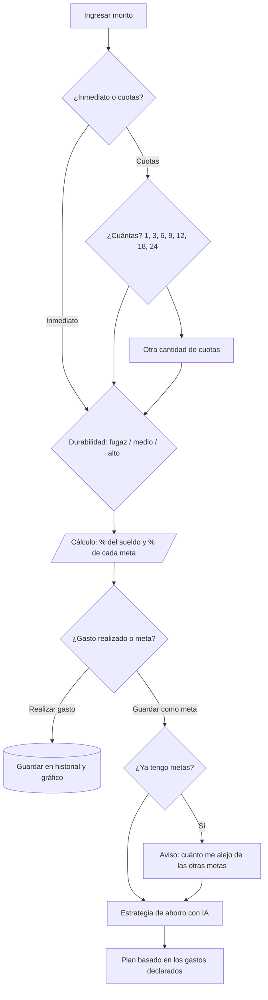
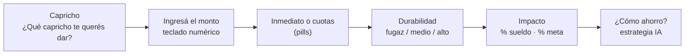
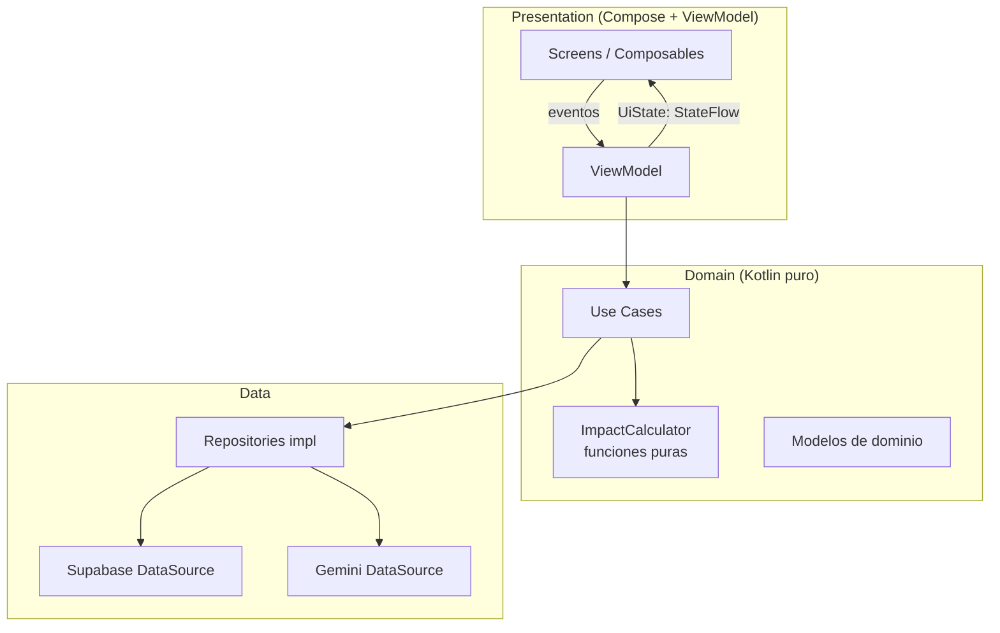
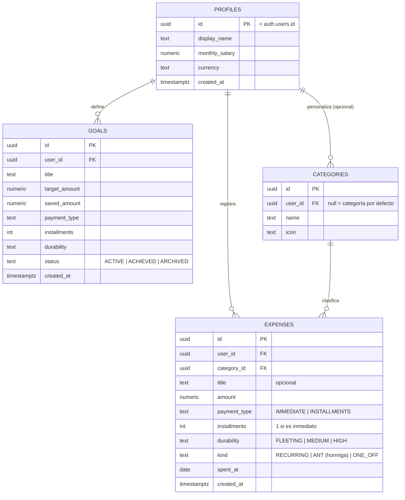

# 🐻 Capricho

> **Date el gusto, pero sabiendo lo que te cuesta.**
> App de finanzas personales hecha con Kotlin Multiplatform que te ayuda a decidir si un gasto te conviene *antes* de hacerlo, sin culpa y sin planillas.

Proyecto desarrollado para el **Challenge Técnico - Software Engineer Mobile (AranguriApps)**.


---

## 📑 Índice

1. [De qué trata el proyecto](#-de-qué-trata-el-proyecto)
2. [Visión](#-visión)
3. [Historia de usuario](#-historia-de-usuario)
4. [Funcionalidades](#-funcionalidades)
5. [Flujo principal y lógica de cálculo](#-flujo-principal-y-lógica-de-cálculo)
6. [Especificaciones técnicas](#-especificaciones-técnicas)
7. [Arquitectura y por qué la elegí](#-arquitectura-y-por-qué-la-elegí)
8. [Modelo de datos (Supabase)](#-modelo-de-datos-supabase)
9. [Uso de IA en el desarrollo](#-uso-de-ia-en-el-desarrollo)
10. [Cómo compilar y correr el proyecto](#-cómo-compilar-y-correr-el-proyecto)
11. [Testing y CI](#-testing-y-ci)
12. [Roadmap y plan de commits](#-roadmap-y-plan-de-commits)
13. [Funcionalidades futuras](#-funcionalidades-futuras)
14. [Decisiones y trade-offs](#-decisiones-y-trade-offs)

---

## 🎯 De qué trata el proyecto

**Capricho** es una app móvil (Android + iOS) para personas **sin conocimientos de finanzas** que quieren cuidar su bolsillo sin sentirse juzgadas.

La idea central es simple: en vez de registrar un gasto *después* de hacerlo, la app te pregunta **"¿qué capricho te querés dar?"** y, en 4 toques, te muestra **cuánto representa ese gasto de tu sueldo** y **cuánto te aleja de tus metas**. Con esa información, el usuario decide si lo **realiza como gasto** o lo **guarda como meta**. Si lo guarda como meta, una IA le sugiere una **estrategia de ahorro** basada en sus propios gastos.

La app tiene dos núcleos que van de la mano:

| Núcleo | Qué resuelve | Prioridad |
|---|---|---|
| **Core principal** | Flujo guiado "Capricho": monto → cuotas → durabilidad → impacto → gasto o meta → estrategia con IA | **Imprescindible** (es el home) |
| **Core secundario** | Dashboard con gráfico de gastos, historial y agrupación por categoría y por período | Complementario (se hace al final, pero es necesario: para ahorrar hay que ver en qué se gasta) |

---

## 🌱 Visión

Cuidar el bolsillo del usuario y ayudarlo a **proyectar sus gastos de forma eficiente, cómoda y agradable**, sin generarle culpa.

Principios de producto:

- **Cero culpa.** Tono amigable, una mascota simpática, lenguaje cercano. La app informa, no reta.
- **Cero conocimiento financiero previo.** Nada de tasas, TNA ni jerga. Débito/crédito se vuelve indistinto: lo único que importa es *inmediato o en cuotas*.
- **Mínima fricción.** El usuario casi no escribe: ingresa el monto con un teclado numérico y el resto se resuelve tocando **tags/pills**.
- **Información antes que registro.** La app es útil en el momento de decidir, no solo para llevar la contabilidad.
- **Salud financiera progresiva.** Del "¿me conviene?" a "¿cómo llego antes a mi meta?".

---

## 👤 Historia de usuario

> **Lucía, 27 años, sueldo de $1.700.000.** No sabe de finanzas, pero siempre llega justa a fin de mes. Quiere comprarse unas zapatillas de $240.000 y, a la vez, está ahorrando para un viaje (meta "Bariloche").

1. Lucía abre la app por primera vez, entra con **Google** y completa un **onboarding corto**: su nombre y su sueldo actual. No se lo vuelve a pedir nunca más (lo puede editar en su perfil).
2. En el home, la mascota le pregunta: **"¿Qué capricho te querés dar?"**. Toca *Empezar*.
3. Escribe el **monto** con el teclado numérico (sin ponerle nombre todavía).
4. Elige **inmediato** o **en cuotas** y, si son cuotas, toca la pill de cuántas (1, 3, 6, 9, 12, 18, 24 u *otra*).
5. Elige la **durabilidad**: *fugaz*, *medio* o *alto* (qué tanto le va a durar/servir).
6. La mascota le muestra: *"Este gasto representa el 14% de tu sueldo actual"* y *"Si lo sumás, te alejás 3 semanas de tu meta Bariloche"*.
7. Decide: **Realizar gasto** (queda en su historial y en el gráfico) o **Guardar como meta**.
8. Si lo guarda como meta, puede tocar **"Estrategia de ahorro"** y la IA le propone, en base a sus gastos reales (alquiler, transporte, comida, ropa…), un plan razonable para llegar más rápido o para que el porcentaje sea menor.
9. Después puede ir al **dashboard** a ver su gráfico de gastos (semanal / mensual / anual), su historial y sus gastos hormiga.

---

## ✨ Funcionalidades

### Core principal (MVP obligatorio)
- [ ] Login con Google (Supabase Auth)
- [ ] Onboarding (nombre + sueldo actual) persistido en Supabase
- [ ] Home "Capricho" con mascota animada
- [ ] Ingreso de monto con teclado numérico propio
- [ ] Selección inmediato / cuotas con pills (1, 3, 6, 9, 12, 18, 24, otra)
- [ ] Selección de durabilidad (fugaz / medio / alto)
- [ ] Cálculo de impacto: % del sueldo y % de cada meta activa
- [ ] Guardar como **gasto** o como **meta**
- [ ] Pantalla de **estrategia de ahorro** generada por IA (Gemini)

### Core secundario (se hace al final)
- [ ] Dashboard con **gráfico de torta** por categoría
- [ ] Filtro de período: **semanal / mensual / anual**
- [ ] **Historial** de gastos
- [ ] Categorías (transporte privado, comida, salud, ropa, juegos, etc.)
- [ ] Marca de **gasto hormiga** (esporádico) vs. **gasto mensual** (recurrente)
- [ ] Edición de perfil (sueldo, nombre)
- [ ] Listado y edición de metas

---

## 🔁 Flujo principal y lógica de cálculo

### Diagrama de flujo



### Pantallas del core principal



### Reglas de cálculo

Todo el cálculo vive en **funciones puras en `commonMain`** (sin dependencias de UI ni red), para poder testearlas fácilmente.

**1. Impacto sobre el sueldo**

| Tipo | Fórmula |
|---|---|
| Inmediato | `impacto = monto / sueldo` |
| En N cuotas | `cuota = monto / N` · `impacto mensual = cuota / sueldo` · compromiso: `N` meses |

> Para el MVP se asume **cuotas sin interés** (es lo más común en el público objetivo y evita pedir datos financieros). Queda como mejora opcional agregar un campo de interés.

**2. Impacto sobre una meta**

```
% de la meta   = monto / (meta.target - meta.saved)
atraso (meses) = monto / capacidadDeAhorroMensual
```

`capacidadDeAhorroMensual` se estima como `sueldo − gastos mensuales declarados` (si es ≤ 0, se informa sin calcular atraso).

**3. Semáforo según durabilidad**

La durabilidad modula **cómo se interpreta** el porcentaje. Un gasto que dura años tolera más impacto que uno fugaz.

| Durabilidad | Significado | Horizonte | Umbral verde | Umbral amarillo | Rojo |
|---|---|---|---|---|---|
| **Fugaz** | Se consume rápido | hasta ~1 mes | < 5 % | 5–10 % | > 10 % |
| **Medio** | Útil por un tiempo | 1 a 5 meses | < 10 % | 10–25 % | > 25 % |
| **Alto** | Te sirve a largo plazo | 6 meses o más | < 20 % | 20–40 % | > 40 % |

> Los umbrales son heurísticas de producto, centralizadas en una única clase de configuración para poder ajustarlas sin tocar la lógica.

El mensaje al usuario siempre es **informativo y amable** (ej: *"Es un gasto grande para algo fugaz, ¿lo pensamos un poco?"*), nunca prohibitivo.

### Estrategia de ahorro con IA

- Se usa la **API de Gemini** (tier gratuito).
- La app **no manda texto libre del usuario**: arma un *prompt estructurado* con datos ya agregados (sueldo, gastos por categoría, meta, porcentaje de impacto).
- Se le dan **reglas estrictas a la IA** (system prompt): propuestas realistas, sin recortes extremos, tono amigable, máximo N sugerencias, respuesta en **JSON con esquema fijo** para poder renderizarla en UI nativa.
- Se valida y parsea la respuesta; si falla, hay un **fallback** con consejos genéricos para que el flujo nunca se rompa.

---

## 🛠 Especificaciones técnicas

### Stack

| Capa | Tecnología |
|---|---|
| Lenguaje | Kotlin (Multiplatform) |
| UI | Compose Multiplatform (Material 3) |
| Plataformas | Android e iOS |
| Navegación | Navigation Compose multiplataforma (JetBrains) |
| Estado | `ViewModel` multiplataforma + `StateFlow` (UDF) |
| DI | Koin |
| Backend / BaaS | Supabase (Auth + Postgres + RLS) con `supabase-kt` |
| Login | Google Sign-In vía Supabase Auth |
| Red | Ktor Client (engines `OkHttp` en Android y `Darwin` en iOS) |
| Serialización | `kotlinx.serialization` |
| Fechas | `kotlinx-datetime` |
| IA | Gemini API (REST con Ktor) |
| Gráficos | Gráfico de torta propio con `Canvas` de Compose (sin dependencias nativas) |
| Mascota / animación | Animaciones de Compose (`Animatable`, `InfiniteTransition`); opcional Lottie multiplataforma |
| Tests | `kotlin.test`, `kotlinx-coroutines-test`, Turbine, fakes manuales |
| CI | GitHub Actions |

> ⚠️ Todas las librerías elegidas son compatibles con KMP/CMP. Se evitan dependencias exclusivas de Android (Hilt, Retrofit, Room, Coil 2, etc.).

### Seguridad de las claves
- Las **claves públicas** de Supabase (`URL` y `anon key`) se leen desde `local.properties` / variables de entorno (no se commitean).
- La **API key de Gemini no debe vivir en el cliente** en producción. Para el challenge se usa una **Supabase Edge Function** como proxy (la app llama a la función con el JWT del usuario y la función llama a Gemini). Si el tiempo no alcanza, se deja la key en `local.properties` y se documenta como deuda técnica.
- Todas las tablas usan **Row Level Security**: cada usuario solo ve sus datos.

### Requisitos no funcionales
- Sin crashes: todo acceso a red se envuelve en un `Result`/sealed class de errores.
- Estados de UI explícitos: `Loading`, `Content`, `Error`, `Empty`.
- Manejo de recomposiciones: estados inmutables (`@Immutable`/`@Stable`), `remember`/`derivedStateOf` donde corresponda, `key` en listas.

---

## 🏛 Arquitectura y por qué la elegí

**MVVM + Unidirectional Data Flow (UDF), con capas inspiradas en Clean Architecture**, todo en código compartido (`commonMain`).



**Por qué esta arquitectura:**

- **Separación lógica / vista** (criterio explícito del challenge): los composables solo renderizan un `UiState` y emiten eventos; nada de lógica de negocio en la UI.
- **Dominio testeable:** el corazón de la app es matemático (porcentajes, cuotas, semáforos). Al ser Kotlin puro en `commonMain`, se testea con unit tests en milisegundos y corre igual en Android e iOS.
- **UDF con un único `UiState` por pantalla:** hace predecible el estado, evita recomposiciones innecesarias y simplifica el flujo de varios pasos del "Capricho".
- **Repositorios como interfaces:** permiten reemplazar Supabase/Gemini por fakes en los tests y facilitan sumar funcionalidades futuras (gastos compartidos).
- **Pragmatismo:** no se sobre-ingeniería. Sin capas de mappers innecesarias ni módulos Gradle por feature; **estructura por paquetes feature-first** dentro de un solo módulo, que es lo adecuado para el alcance del challenge.

### Estructura del proyecto

El proyecto sigue la estructura estándar del wizard de KMP: un módulo `shared` con **todo el código compartido** (lógica + UI en Compose Multiplatform) y un módulo `androidApp` que solo actúa como punto de entrada de Android.

```
capricho/
├── androidApp/                        # Entry point Android (MainActivity, manifest) → genera el APK
├── iosApp/                            # Proyecto Xcode (entry point iOS)
├── shared/
│   └── src/
│       ├── commonMain/kotlin/com/example/caprichoapp/
│       │   ├── App.kt                 # Raíz de Compose + KoinApplication
│       │   ├── core/
│       │   │   ├── designsystem/      # Tema, colores, tipografías, componentes (Pill, Mascot, NumPad)
│       │   │   ├── navigation/
│       │   │   ├── network/           # Cliente Supabase, Ktor, manejo de errores
│       │   │   └── di/                # Módulos Koin (AppModule.kt)
│       │   ├── feature/
│       │   │   ├── auth/
│       │   │   ├── onboarding/
│       │   │   ├── capricho/          # Core principal (flujo paso a paso)
│       │   │   ├── goals/
│       │   │   ├── strategy/          # Estrategia IA
│       │   │   ├── dashboard/         # Core secundario
│       │   │   ├── history/
│       │   │   └── profile/
│       │   └── domain/
│       │       ├── model/
│       │       ├── calculator/        # ImpactCalculator, DurabilityPolicy
│       │       ├── repository/        # Interfaces
│       │       └── usecase/
│       ├── commonMain/composeResources/   # Fuentes, imágenes, strings
│       ├── commonTest/                # Tests de lógica compartida (corren en JVM)
│       ├── androidMain/               # Implementaciones específicas de Android
│       ├── androidHostTest/           # Tests unitarios que corren en JVM (Android)
│       ├── iosMain/                   # MainViewController + implementaciones iOS
│       └── iosTest/
├── supabase/
│   ├── migrations/                    # SQL del esquema + RLS
│   └── functions/gemini-proxy/        # Edge Function (proxy de IA)
├── docs/                              # Diagramas, capturas y log de IA
├── .github/workflows/ci.yml           # Integración continua
├── gradle/libs.versions.toml          # Catálogo de versiones
└── README.md
```

> El paquete base es `com.example.caprichoapp` (valor del template). Se puede renombrar a uno propio antes de configurar el login con Google.

---

## 🗄 Modelo de datos (Supabase)



**Ejemplo de política RLS:**

```sql
alter table expenses enable row level security;

create policy "Usuarios ven y editan solo sus gastos"
on expenses for all
using (auth.uid() = user_id)
with check (auth.uid() = user_id);
```

> 🔮 **Pensado para el futuro:** `user_id` está presente en todas las tablas y el esquema permite sumar luego una tabla `shared_groups` + `group_members` sin migraciones destructivas (ver [Funcionalidades futuras](#-funcionalidades-futuras)).

---

## 🤖 Uso de IA en el desarrollo

El challenge pide orquestar IA, no copiar y pegar. Mi flujo de trabajo:

| Herramienta | Para qué la usé | Cómo auditaba su salida |
|---|---|---|
| **Claude** | Definir el alcance, estructurar la idea en README, diseñar el flujo, el modelo de datos y las reglas de cálculo; generar boilerplate de KMP/Compose | Revisión manual de cada decisión; contraste con documentación oficial de KMP y supabase-kt |
| **Asistente de código en el IDE** (Claude Code / Copilot / Gemini Code Assist, completar según uso real) | Generar composables, ViewModels, repositorios y tests unitarios por tarea | Compilar en Android (e iOS cuando hay macOS disponible), correr tests, revisar diffs antes de cada commit |
| **Gemini API** | Funcionalidad *dentro* de la app: estrategias de ahorro | System prompt con reglas, salida en JSON validada, fallback ante errores |

**Cómo guié a la IA:**
- Trabajé **tarea por tarea** (una funcionalidad = un prompt acotado = un commit), siempre con el contexto de arquitectura y convenciones del proyecto.
- Primero la **lógica de dominio con tests**, después la UI. Los tests me sirvieron como contrato para detectar errores de la IA.
- Corregí problemas que la IA ignora o resuelve mal en KMP: dependencias solo-Android, `expect/actual`, diferencias de comportamiento en iOS, recomposiciones innecesarias, manejo de errores de red.
- Cada prompt relevante y su resultado se resume en [`docs/ai-log.md`](docs/ai-log.md) *(a completar durante el desarrollo)*.

---

## 🚀 Cómo compilar y correr el proyecto

### Requisitos
- **JDK 17+**
- **Android Studio** (última versión estable) con el plugin *Kotlin Multiplatform*
- **Xcode 15+** y macOS (solo para correr iOS)
- Cuenta gratuita de **Supabase** y una API key de **Gemini** (Google AI Studio)

> ℹ️ **Sobre iOS:** el proyecto desarrolla y verifica en Android. Compilar y probar iOS requiere macOS + Xcode. En Windows/Linux, Gradle muestra el aviso *"iosSimulatorArm64Test is disabled"*; es esperable y se silencia con `kotlin.native.ignoreDisabledTargets=true` en `gradle.properties`.

### 1. Clonar
```bash
git clone https://github.com/Gaburiiru/capricho.git
cd capricho
```

### 2. Configurar Supabase
1. Crear un proyecto en [supabase.com](https://supabase.com).
2. Ejecutar las migraciones de `supabase/migrations/` en el SQL Editor.
3. En *Authentication → Providers* habilitar **Google** y cargar el Client ID/Secret de Google Cloud.
4. Copiar la **Project URL** y la **anon key**.

### 3. Variables de entorno
Crear `local.properties` en la raíz (está en `.gitignore`):

```properties
SUPABASE_URL=https://xxxx.supabase.co
SUPABASE_ANON_KEY=eyJ...
GOOGLE_WEB_CLIENT_ID=xxxx.apps.googleusercontent.com
# Solo si no usás la Edge Function proxy:
GEMINI_API_KEY=AIza...
```

### 4. Correr en Android
Abrir el proyecto en Android Studio, elegir la configuración `androidApp` y ejecutar en un emulador o dispositivo. O por terminal:

```bash
./gradlew :androidApp:installDebug
```

### 5. Generar el APK
```bash
# Debug (instalable directo)
./gradlew :androidApp:assembleDebug
# APK en androidApp/build/outputs/apk/debug/

# Release (requiere firma configurada)
./gradlew :androidApp:assembleRelease
```

### 6. Correr en iOS (macOS)
1. Abrir `iosApp/iosApp.xcodeproj` en Xcode (o usar la configuración `iosApp` de Android Studio).
2. Elegir un simulador y presionar **Run**.

### 7. Tests
```bash
./gradlew :shared:testAndroidHostTest
```

---

## ✅ Testing y CI

- **Unit tests (`commonTest`):** `ImpactCalculator`, `DurabilityPolicy` y casos de uso. Son Kotlin puro y corren en JVM, sin emulador.
- **ViewModels (opcional):** con `Turbine` + repositorios *fake* (versiones en memoria, sin depender de Supabase).
- **Casos de borde cubiertos:** sueldo = 0, monto = 0, cuotas = 1, metas sin ahorro, meta ya cumplida, fallo de red, respuesta inválida de la IA.
- **CI con GitHub Actions:** en cada push/PR compila Android y ejecuta los tests unitarios. Los tests no son "de GitHub": el CI solo corre automáticamente los mismos tests que se ejecutan en local.

```bash
# Tests unitarios (Android host / JVM)
./gradlew :shared:testAndroidHostTest
```

```yaml
# .github/workflows/ci.yml
name: CI

on:
  push:
  pull_request:

jobs:
  build-and-test:
    runs-on: ubuntu-latest
    steps:
      - uses: actions/checkout@v4

      - uses: actions/setup-java@v4
        with:
          distribution: temurin
          java-version: 17

      - uses: gradle/actions/setup-gradle@v4

      - name: Tests y build
        run: ./gradlew :shared:testAndroidHostTest :androidApp:assembleDebug
```

> El CI no compila iOS: requiere un runner macOS, más lento y costoso. Ver nota de iOS en [Cómo compilar](#-cómo-compilar-y-correr-el-proyecto).

---

## 🗓 Roadmap y plan de commits

Fecha límite de entrega: **8 de octubre de 2026, 23:59**. El plan va **de menor a mayor** y prioriza el core principal. Cada ítem es un commit (o un par) con mensaje claro bajo *Conventional Commits* (`feat:`, `fix:`, `test:`, `docs:`, `chore:`).

### Fase 0 · Base
- [x] `docs: README inicial con visión, flujo y arquitectura`
- [x] `chore: proyecto KMP base (template de JetBrains)`
- [x] `chore: agregar Koin y Ktor al proyecto KMP`
- [x] `chore: eliminar código de ejemplo del template`
- [x] `feat(design): tema, paleta y tipografías`
- [ ] `feat(design): componentes base (Pill, NumPad, Mascot)`
- [ ] `chore(ci): workflow de GitHub Actions`

### Fase 1 · Dominio (con tests)
- [ ] `feat(domain): modelos Expense, Goal, Profile`
- [ ] `feat(domain): ImpactCalculator (% sueldo, % meta, cuotas)`
- [ ] `feat(domain): DurabilityPolicy y semáforo`
- [ ] `test(domain): casos de borde del cálculo`

### Fase 2 · Backend y sesión
- [ ] `feat(supabase): esquema SQL + RLS`
- [ ] `feat(auth): login con Google`
- [ ] `feat(onboarding): nombre + sueldo, persistido en Supabase`

### Fase 3 · Core principal
- [ ] `feat(capricho): pantalla inicial con mascota animada`
- [ ] `feat(capricho): ingreso de monto con teclado numérico`
- [ ] `feat(capricho): inmediato/cuotas con pills`
- [ ] `feat(capricho): durabilidad`
- [ ] `feat(capricho): pantalla de impacto (% sueldo / % meta)`
- [ ] `feat(expenses): guardar como gasto`
- [ ] `feat(goals): guardar como meta`
- [ ] `feat(strategy): estrategia de ahorro con Gemini + fallback`

### Fase 4 · Core secundario
- [ ] `feat(dashboard): gráfico de torta por categoría`
- [ ] `feat(dashboard): filtros semanal/mensual/anual`
- [ ] `feat(history): historial de gastos`
- [ ] `feat(expenses): categorías y gasto hormiga`
- [ ] `feat(profile): edición de sueldo y nombre`

### Fase 5 · Pulido y entrega
- [ ] `fix/refactor: auditoría de crashes, estados vacíos y errores de red`
- [ ] `feat(ui): transiciones entre pasos y animaciones de la mascota`
- [ ] `docs: capturas, diagramas y log de uso de IA`
- [ ] `chore: APK release firmado + tag v1.0.0`
- [ ] 📧 Mail a `info@aranguriapps.com` — Asunto: **[NOMBRE APELLIDO - Challenge tecnico AranguriApps]**, con link al repo y APK.

> **Regla de oro del tiempo:** si algo del core secundario no llega, se recorta *funcionalidad*, nunca *estabilidad*. Una app sencilla, fluida y que no crashea vale más que una app grande y frágil.

---

## 🔮 Funcionalidades futuras

Fuera del alcance del challenge, pero **contempladas en el diseño de datos**:

- **Gastos compartidos / sección con amigos "tipo red social":** invitar a otro usuario para registrar gastos en conjunto (pareja, viaje, departamento). Requeriría tablas `shared_groups` y `group_members`, y políticas RLS por grupo.
- **Estrategias de ahorro avanzadas:** simulaciones ("¿y si recorto transporte un 15 %?"), metas con fecha objetivo, recordatorios.
- **Gastos recurrentes automáticos** y alertas de suscripciones olvidadas.
- **Cuotas con interés** y comparación contado vs. cuotas.
- **Notificaciones** semanales con resumen amable.
- **Modo offline** con sincronización (cache local + cola de escritura).
- **Multi-moneda** y ajuste por inflación.

---

## 🧠 Decisiones y trade-offs

| Decisión | Alternativa descartada | Motivo |
|---|---|---|
| Un solo módulo, paquetes por feature | Multi-módulo Gradle | Menos fricción y más velocidad para el alcance de ~5 días |
| Supabase como BaaS | Mock server con Express | Aporta auth real, Postgres y RLS sin mantener servidor propio |
| Gráfico de torta con `Canvas` | Librería de charts | Cero problemas de compatibilidad KMP/iOS y control total de animaciones |
| Cuotas sin interés en el MVP | Pedir tasa al usuario | El público objetivo no maneja estos datos; reduce fricción |
| Tags/pills en vez de campos de texto | Formulario clásico | Menor fricción, mejor UX en mobile y datos más limpios |
| Proxy de Gemini vía Edge Function | Key en el cliente | Nunca exponer secretos en una app distribuida |
| Core secundario al final | Hacerlo en paralelo | El flujo "Capricho" es el diferencial y lo imprescindible |

---

## 📄 Licencia

MIT — ver [LICENSE](LICENSE).

---

<p align="center">Hecho con ☕, Kotlin y bastante ayuda de la IA · <b>Capricho</b></p>
